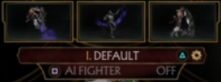

# PS4MK11Macro
A macro for Mortal Kombat 11 that automatically runs towers (currently just the survivor tower) using PS4Macro and PS4 Remote Play.

# Setup
* Install and set up PS4 remote play from the official site https://remoteplay.dl.playstation.net/remoteplay/lang/en/index.html.
* Download and unzip PS4Macro from here: https://github.com/komefai/PS4Macro.
* Download the latest release of this plugin from the releases page (or build it from source).
* Run the PS4 remote play app, then run PS4Macro.
* On PS4Macro, click File>Open and then open the PS4MK11Macro DLL.
* Ensure that your gamma setting in MK11 is set to 50 (default).
* Set up your first slot on Noob Saibot to be AI-friendly (i.e. 30 kombos, 30 reversal, combo-friendly abilities).
  * Note that the particular image on-screen it's looking for is this variant:
    
    
    It's recommended to run this for now, though eventually this should support other variants.
* Navigate to the Klassic Towers, then hover over the Survivor Tower.
* Click the play button on PS4Macro.
* Do whatever you feel like while the bot runs the survivor tower over and over again.

# Notes:
You may need to turn on controller emulation if you want to use a ps4 controller separately on the PC running this, or if you don't have a ps4 controller handy; refer to the documentation on "EmulateController" on the PS4Macro repository for how to do so.

If your PC goes to sleep, or if your connection is lost, etc., the macro will stop working.

You can set up PS4Macro to automatically load a file on startup; this saves you a File>Open step if you plan on using this frequently.
